<h3><code>dawood@github:~$ ./contributions.sh</code></h3>

  

<h3><code>dawood@github:~$ whoami</code></h3>

<table>
  <tr>
    <td valign="top"></td>
    <td valign="top"></td>
  </tr>
</table>

 

<code>Web Developer · App Developer · Game Developer</code>

  

<a href="mailto:dawoodilyas54@gmail.com">Email</a>
&nbsp;·&nbsp;
<a href="https://www.linkedin.com/in/muhammad-dawood-45ab1b32b/">LinkedIn</a>
&nbsp;·&nbsp;
<a href="https://github.com/Dawood-code?tab=repositories">Projects</a>

<!-- Animated SVG approach inspired by Avi Vashishta's profile README guide. -->
